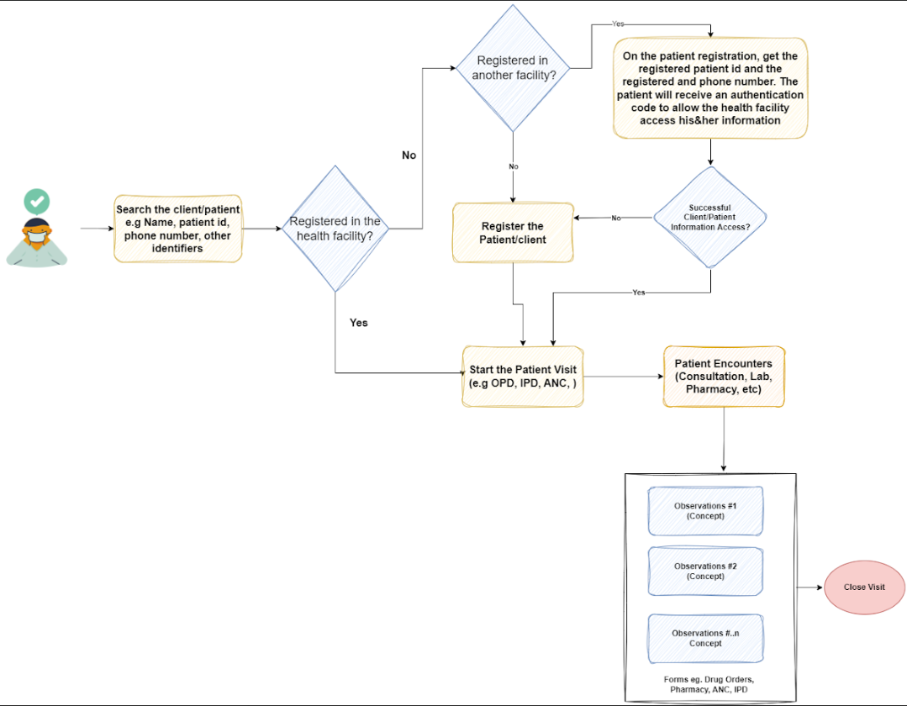
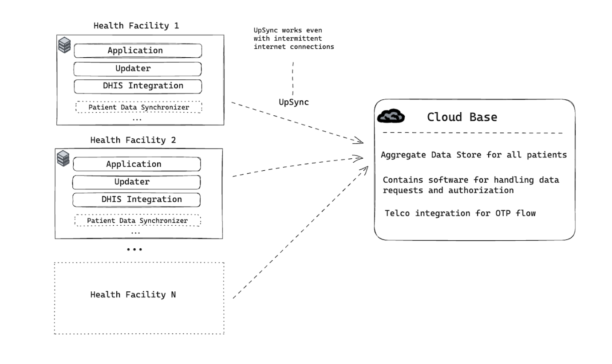
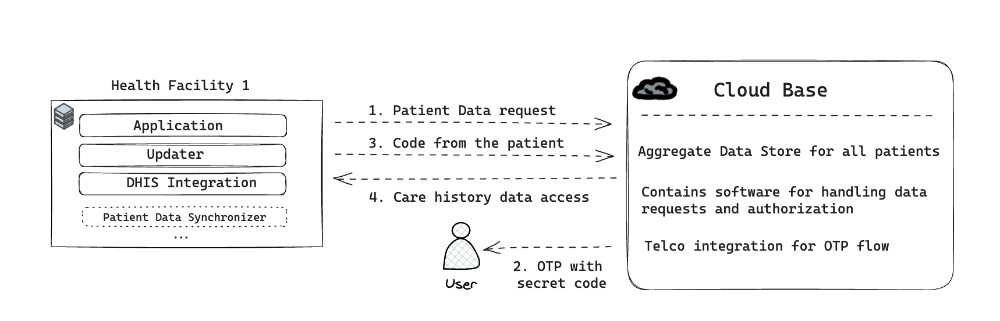

# RAAD EHR ROADMAP
## Introduction
### Purpose of Roadmap
The purpose of the RAAD EHR roadmap is to provide a blueprint on the implementation and roll out of the RAAD EHR in Somalia, timeline, costs and the  anticipated plan of actions by the Federal and States Ministry of Health. The document gives guidance to implementers, users and funders on the work the Ministry of Health is carrying out, and the goals and objectives  intended to be achieved.

The EHR roadmap describes what has been achieved to-date and describes further on how the Federal and State Ministry of Health plans to better coordinate the expansion and integration into the health service delivery at all levels through setting up of ICT infrastructure, and the training of health workers in the use of ICT to improve efficiency of health services delivery.

The RAAD EHR system roadmap is a living document and will continue to receive regular updates on quarterly and annual basis given the dynamic nature of delivering health services, new learning and improvements from the pilot implementation, and the changes in the technology. 

### Background & Current Status
Somalia is emerging from decades of conflict which destroyed government institutions and the
social and economic infrastructure of the country, resulting in the absence of government control, oversight, and funding of the basic social services such as health and education. After years of statelessness, a provisional constitution was adopted in 2011 which paved the way for the establishment of the current Federal Government of Somalia (FGS) and its subsequent formal recognition by the international community in 2012. 

The health sector, like the other social service sectors, is recovering from the disintegration and
dysfunction of state institutions. The Ministry of Health Somalia realizing the importance of reliable data in decision-making, efforts of rebuilding HIS had commenced with the conception of the EPHS in 2009 as the main vehicle of health service delivery. Subsequently, the first Somalia post-civil war Health Sector Strategic Plan (HSSP I) laid the foundation for development of the public health management information system in 2013. The plan provided strategic directions and established a public health sector information management system to capture a core set of health data indicators with health facilities as primary sources of data.
Subsequently, in collaboration with development partners, MoH in 2017 adopted a DHIS2-based M&E system to provide data management functions on collection, analysis and reporting of quality health data for health programs.

Despite the challenges, over the past decade, the implementation of information systems strategic interventions have transformed ways in which health data and information is collected, stored, analyzed and disseminated at state and regional governance levels. Somalia HMIS has been at the forefront of this transformation on the collection, analysis, and use of health information for evidence decision making. 

While the implementation of the Somalia HMIS on the DHIS2 platform has improved the reporting flow from health facilities to district/state/federal levels, a critical challenge persists at the health facility level. Patient data collection and management still rely on cumbersome and error-prone paper-based methods, primarily using registers. This approach has resulted in various data quality issues, including underreporting, incomplete records, and occasional inaccuracies. Furthermore, the paper-based system is time-consuming, difficult to maintain, and susceptible to data entry errors and illegible handwriting, highlighting the need for a more efficient and reliable data management solution.

Through the Health Alliance for Digital Development and Action (HADDA) program support to the Ministry of Health on enhancing Somalia's digital health information system. The primary objective of the program is to strengthen the Ministry of Health in Somalia HIS systems to report accurate and dependable information that can serve as the foundation for decision-making at both the Federal and Member State levels

HADDA's approach is based on the findings and recommendations derived from the baseline Health Information System (HIS) assessment. 
The program identified specific areas of focus, which include:

* Digitalization of HMIS (Health Management Information System) tools at the health facility: Support digitalizing the tools and systems used in  health facilities. This digitalization aims to streamline patient level data collection, management, and reporting within the healthcare system, making it more efficient and accurate.

* Strengthening Stewardship and Governance Capacity: Enhance the ability of the Ministries of Health (both at the federal and state levels) to effectively manage the digital health information system. This includes improving their governance capacity, ensuring data security, and enabling efficient data utilization for informed decision-making.

RAAD EHR implementation is introduced as a solution to the digitalization of the HMIS tools to improve the use, reporting, and data quality at healthcare facilities. This will help healthcare providers maintain patient records, streamline clinical processes, and ensure interoperability with the broader Health Management Information System (HMIS). The RAAD EHR  will support the following areas:

1. Outpatient and Inpatient Services.

2. Program-specific services (TB, HIV/AIDS).

3. Integrated public health and clinical surveillance.

4. Registration and management of patients/clients' information.

5. Clinical management.

6. Pharmacy/medication management.

7. Lab management.

8. Data management, reporting, and data analysis.

9. Clinical decision support.

10. Integration with other software platforms such as DHIS2.

The development of the RAAD EHR will be built on experience and lessons learnt from implementing systems such as the Somalia HMIS, and other digital collection tools(ONA, etc), to come up with an EHR that works within the local health facility environment. This system will need to take into account technical and infrastructural constraints as well as the skills of the intended primary users of the system.

### EHR Objectives

The overall goal of the RAAD EHR development and deployment is to implement a standards-based, interoperable, patient-centric system that supports end-to-end patient care and management across the continuum of care. This aims to ensure the delivery of high-quality health services and facilitate timely, accurate reporting for evidence-based decision-making.

The specific objectives of the RAAD EHR are as follows:

* Enhance patient care and management throughout the continuum of care.

* Improve the quality of care within the health delivery system.

* Support patient care and management at all levels of the healthcare system.

* Ensure integration and interoperability with other health systems, including seamless integration with Somalia's HMIS (DHIS2) for monthly reporting.

* Provide timely and accurate information to support evidence-based decision-making at all levels of healthcare delivery.

### Short-Term Outputs/Outcomes 

Digitize all existing paper-based registers and integrate them into the EHR platform for seamless data management.

Establish the minimum required ICT infrastructure to fully operationalize the EHR system across health facilities.

Complete EHR installation in at least 70% of service delivery points, ensuring widespread adoption and functionality.

Conduct comprehensive training for healthcare workers on using the EHR system and digital tools for effective patient and client management.

Achieve 90% integration of report generation with DHIS2, ensuring timely and accurate health data reporting.

### EHR Justification

The implementation of an Electronic Health Record (EHR) system is essential for enhancing health service delivery and improving patient outcomes. Currently, the reliance on paper-based systems for patient management is not only inefficient but also prone to errors and delays, leading to significant gaps in reporting critical health indicators. This under-reporting hampers the ability to make evidence-based decisions, which are crucial for effective planning, resource allocation, and disease control.

An EHR system ensures accurate, real-time data collection, enabling health facilities to streamline patient management, enhance surveillance, and improve program-specific reporting. It also strengthens the integration with national health platforms like DHIS2, allowing for timely, comprehensive data reporting. Moreover, EHRs provide a centralized and secure way to manage patient information, reducing duplication, improving care coordination, and supporting long-term health planning.

In a healthcare system increasingly driven by data, the shift from paper-based records to a digital infrastructure is vital. An EHR not only improves operational efficiency but also fosters a culture of accountability, transparency, and continuous improvement across healthcare facilities, paving the way for better health outcomes and informed decision-making at all levels.
 
### EHR Advantages

Electronic Health Records(EHRs) provide the ability to exchange health information digitally, enabling higher quality and safer care for patients/clients. EHRs help healthcare providers improve the care of their patients/clients in the following ways:

* Improved Patient Care: With immediate access to patient histories, laboratory results, and medication information, healthcare providers can make more informed decisions.

* Accurate and Up-to-Date Information: EHRs provide accurate, up-to-date, and complete information about patients at the point of care.

* Coordinated and Efficient Care: EHRs enable quick access to patient records, enhancing data management through a centralized platform for storing, managing, accessing, and updating information.

* Secure Data Sharing: EHRs facilitate the secure sharing of patient/client information among healthcare providers.

* Safer and More Reliable Care: EHRs support providers in more effectively diagnosing patients, reducing medical errors, and providing safer care.

* Enhanced Patient-Provider Interaction: EHRs improve patient and provider interaction, communication, and healthcare convenience.

* Safer Prescribing: EHRs enable safer and more reliable prescribing.

* Improved Documentation: EHRs promote legible, complete documentation and accurate, streamlined coding, reducing errors associated with poor handwriting, lost or damaged paper records, and incomplete patient information.

* Enhanced Privacy and Security: EHRs improve the privacy and security of patient/client data and information.

* Increased Provider Efficiency: EHRs enhance provider efficiency, reduce duplication of tasks, and improve overall health outcomes.

* Disease Tracking and Management: EHRs enable better tracking and management of diseases.

* Cost-Effectiveness: Over time, EHRs are more cost-effective than traditional paper records, reducing the need for physical storage space and materials, and minimizing the duplication of tests and procedures.

## EHR Governance

The governance of the RAAD EHR will be led and coordinated by the Federal and State Ministry of Health & Human Services - Health Information Management System Section. The Federal & State Ministry of Health & Human Services will provide the guiding principles related to policies, strategies, and functions to achieve EHR objectives. In addition, the coordination will be done through the technical coordination committee(TCC). 

Key objectives of the Technical Coordinating Committee (TCC) in EHR 
governance include:

* Maintaining Strategic Direction: Ensuring that the development and implementation of the EHR system are aligned with Somalia's long-term healthcare goals and national strategies.

* Establishing Clear Communication & Accountability: Facilitating transparent communication channels and implementing well-defined accountability mechanisms.

* Overseeing Implementation: Supervising the deployment, operational management, and standardization of the EHR system across all regions, ensuring compliance with national standards and preventing conflicting approaches.

## Software Development and Customisation

### Current status
The RAAD EHR system has successfully completed its pilot phase in six health facilities, providing valuable insights and laying the groundwork for broader implementation and scale-up.

###  Sofware Development, Configuration and Customisation

The RAAD EHR is built and customized on the Bahmni platform to model and align to the software requirements specifications for the Somalia EHR. The development of the RAAD EHR utilizes an agile and user-centric approach ensuring there is continuous feedback between the end users and the development team. This facilitates the rapid system development, thorough testing and incorporation of new key functionalities and features that make the system user-friendly and meet the functional requirements. 

The development of new features and additional functionalities are planned using the JIRA project management tool with biweekly sprints. The development team has weekly and regular standup meetings to share the development progress and highlight any blockers or request for additional information. In addition, the testing team has weekly meetings with the focus groups to share and walkthrough the new features and functionalities as well as receive feedback.

This first phase the RAAD EHR has implemented the following MOH register and summaries:

1. ANC (Antenatal Care)

2. Maternity

3. Outpatient Services

4. Birth Spacing

5. Immunization

6. Nutrition

7. Laboratory services

### User Acceptance Testing (UAT)

The UAT process is a critical phase in ensuring that the RAAD EHR system meets user needs and operates effectively in the health facility environment. It will serve as the final validation step before the system is deployed in the health facilities, helping to identify and address any issues that could impact the EHR's functionality and usability.

### Pilot Phase

The RAAD EHR pilot was conducted in six health facilities: two in Banadir, two in Puntland, and two in Galmudug. The pilot featured both online and offline deployments, with one facility in each region utilizing an online setup, while the other operated offline. 

The pilot encompassed the following activities to ensure successful deployment and use:

1. End User Training: Training sessions were conducted to equip end-users with the necessary skills and knowledge to effectively use the RAAD EHR system, following the developed training plan.

2. Deployment of ICT Equipment: The essential ICT equipment required for the EHR system, including hardware and network infrastructure, was deployed and set up in the healthcare facilities.

3. Installation of the RAAD EHR: The EHR software was installed on the deployed server at each health facility. This installation process involved configuring the RAAD EHR to meet the specific needs and requirements of the healthcare facilities.

4. Setup of Health Facility Users:  User profiles and access permissions were created and configured within the RAAD EHR system for health facility users.

5. System Go-Live: The RAAD EHR system was officially launched and put into active use within the pilot healthcare facilities. Healthcare providers began using the system to manage patient records and support healthcare delivery.

## Training

### Development of Training Materials and guides
The training modules for the RAAD EHR:

1. RAAD EHR End User Training Module

2. RAAD EHR System Administrators Training Module

3. RAAD EHR Developer Training Module

4. RAAD EHR Frequently Asked Questions (FAQs)

### System Training

The primary objective of the training program is to empower healthcare workers with the knowledge and 
expertise required to effectively comprehend and utilize the RAAD EHR system. This comprehensive training encompasses three main areas:

* Technical know-how: Health workers will gain foundational understanding of the technical components and intricacies of the RAAD EHR system. This includes familiarity with the system's architecture and underlying technologies.

* Functional Competence: The training will cover the system's functionality, ensuring that healthcare staff can proficiently navigate and utilize its features. This encompasses tasks such as registration, clinical management, data entry, lab management and HMIS reporting.

* Operational Competence: Health workers will be equipped with the skills needed to operate the EHR system seamlessly in their daily tasks. This includes processes related to patient data collection and the utilization of ICT devices as integral tools in their routine work.

In addition, training sessions (virtual and physical) are meticulously planned and scheduled at healthcare facilities to minimize disruption to patient services. Efforts are made to ensure patient care continues smoothly during training, balancing the enhancement of healthcare workers’ capabilities with the uninterrupted delivery of healthcare services.

### EHR Support

To ensure the successful and effective implementation of the RAAD EHR system, a tiered support plan will be designed. This support plan will encompass various levels, ensuring that support is readily available at all stages of the implementation process. The tiered support plan will be organized as follows:

* Level One Support (Health Facility): At the primary level, each health facility will have a dedicated EHR system champion. This champion will serve as the first point of contact for assistance and issue resolution within the facility. Their role is to provide immediate support and guidance to the facility's staff.
* Level Two Support (District): Beyond the health facility level, there will be district-level EHR champions who will oversee and coordinate support efforts within their respective districts. They will collaborate with facility champions to address more complex issues and ensure a seamless flow of information.
* Level Three Support (Region): At the regional level, experienced champions will be in place to manage support operations across multiple districts within a region. They will serve as a resource for district champions and work to resolve challenges that may require a broader perspective.
* Level Four Support (State and National):The highest level of support will involve state and national champions. These experts will handle escalated issues that cannot be resolved at lower tiers. They will also play a pivotal role in advocating for necessary changes or improvements at a broader scale.

This tiered support structure ensures that there is a clear pathway for escalating and resolving issues as they arise during the EHR implementation. It also promotes effective communication and collaboration between different levels of the healthcare system, ultimately contributing to the system's success and sustainability. By having dedicated champions at each level, the support plan maximizes the chances of addressing challenges promptly and comprehensively.

### Pilot System Assesment Evaluation

After conducting a pilot of the RAAD EHR system in six health facilities(2 in Banadir, 2 in Puntland, and 2 in Galmudug), a comprehensive system performance and impact assessment will be carried out. This assessment and validation process will involve representatives from both the Federal and state level. The primary objective of this assessment is to gather insights into the EHR system's performance(functional and non-functional), its effects on healthcare delivery, and its overall impact on the healthcare infrastructure.

The findings and recommendations resulting from this assessment will play a crucial role in shaping the further customization of the EHR system to align with the specific requirements of the broader health system. This ensures that the EHR system evolves to better meet the needs and expectations of healthcare providers and patients.

Furthermore, the RAAD EHR scale-up plan will be heavily influenced by the lessons learned during the pilot evaluation of the EHR system in the initial six facilities. These lessons will provide valuable insights into what worked well, what could be improved, and what adjustments are necessary to implement the system on a larger scale.

## Scale up Plan

### EHR Assessment and Validation Results

Following the implementation and pilot phase of the RAAD EHR in six health facilities, a detailed system performance and impact assessment will be conducted. This process will involve a broad range of key stakeholders, including healthcare providers, software development specialists, RAAD implementing partners, and Federal and State ministry officials. The aim is to evaluate the system's functionality, user experience, and overall impact on healthcare delivery in the pilot period. 

The assessment will encompass various metrics such as system reliability, user satisfaction, efficiency improvements, and any impact on patient care. Additionally, the assessment will seek to identify any challenges or limitations faced during the implementation phase.

From the results and findings, a validation process will be carried out. This will involve analyzing the data to determine how well the system meets its intended goals and identifying areas for improvement. The gathered insights and feedback will inform the next steps of the scale up implementation of the RAAD EHR.

The recommendations derived from this assessment will be integral for further customization of the RAAD EHR system. This will ensure that the system is not only tailored to the specific needs of each health facility but also aligned with the broader objectives of the healthcare system as the RAAD EHR ultimate goal is to create a user-friendly, efficient, and effective EHR platform that enhances healthcare delivery and outcomes.

### Coordination of Rollout to Other Regions
To ensure a successful and seamless expansion of the RAAD EHR system into other regions, a well-coordinated and structured approach is required. The rollout should involve close collaboration between key stakeholders, including the Federal Ministry of Health,State MoH, regional health authorities, technical teams, and local healthcare facilities. Effective coordination is important to ensure that each region and district receives the necessary support, infrastructure, and training for the smooth implementation of the RAAD EHR system.

##### Leadership 

- The Federal Ministry of Health and State Ministries of Health should utilize the Technical Coordination Committee (TCC) both at the federal level and state level, incorporating key stakeholders and relevant government ministries, such as the Ministry of Health ICT, to oversee the national rollout. This committee will ensure alignment with national healthcare strategies while adapting the implementation plan to address the specific needs of each region and district.

- Local and regional health authorities must be actively involved in the planning and deployment stages to account for region-specific challenges, such as resource availability, technical capacity, and geographic barriers. This collaborative approach will help tailor the rollout to fit the unique circumstances of each region.

##### Phased and Prioritized Rollout
* The rollout should be executed in a phased manner, starting with regions that are better equipped in terms of infrastructure and technical readiness. These regions can serve as benchmarks for future implementations, allowing for lessons learned to inform subsequent rollouts.

* Prioritization should be based on healthcare demand, regional capacity, and resource availability.

##### Resource Allocation and Infrastructure Setup
* Coordination should involve a detailed assessment of each region's current infrastructure, including ICT readiness, internet connectivity, and power supply. Based on this assessment, tailored plans should be developed to address gaps in resources, including the deployment of servers, workstations, and network equipment.

* Collaboration with private sector partners and international donors can help address infrastructure needs, particularly in remote or under-resourced regions.

##### Training and Capacity Building
* A coordinated effort to provide standardized training for healthcare workers, administrators, and IT personnel in each region is important to the success of the rollout. Training should cover all aspects of the RAAD EHR system, including patient management, reporting, and system maintenance.

##### Technical Support and Maintenance
* A technical support framework must be put in place to ensure continuous system functionality as the RAAD EHR  is rolled out across regions. This includes establishing local IT support teams in each region and creating a central technical helpdesk for escalation of more complex issues.

* Regular system updates, troubleshooting, and data backup procedures should be standardized across regions to ensure system integrity and security.

* The technical and development team will ensure continuous updates, bug fixes, and future enhancements are addressed and seamlessly deployed.

##### Monitoring and Feedback Mechanisms
* A monitoring and evaluation framework should be implemented to track the progress of the rollout in each region. This framework should include key performance indicators (KPIs) such as system adoption rates, user satisfaction, and improvements in patient care outcomes.

* Feedback loops must be established to gather input from healthcare workers and administrators in each region. This feedback will be key in identifying challenges, refining the system, and making necessary adjustments as the rollout continues.

##### Communication and Reporting
* Clear communication channels should be established to facilitate direct reporting and updates between regional teams and the national and state coordinating committee. Regular progress reports should be shared to ensure transparency and accountability throughout the rollout process.

* Coordination meetings with key stakeholders at national, state, and regional levels should be planned to review progress, address challenges, and ensure that the rollout is on track to meet its goals.

### Integration With Current Systems

The RAAD EHR system integrates with the Somalia HMIS, enabling the automated generation of monthly health summary reports. This integration is facilitated through a middleware reporting application that aggregates data recorded in the RAAD EHR, ensuring accurate and comprehensive reporting. The system supports the review and validation of these reports before they are submitted to the national HMIS platform on a monthly basis. To ensure data security and compliance, only authorized users with valid access credentials can submit reports via the middleware application.

### Continous Enhancement of the EHR

The development and maintenance of the RAAD EHR is a long-term effort, necessitating continuous development and enhancement. This ongoing process supports the introduction of new modules and strengthens existing ones as more health programs are onboarded.

The initial development phase of the RAAD EHR focuses on the MOHs immediate goals, detailed in previously mentioned short-term outcomes. Post-validation, the Federal and State MoH will engage with health facility users and stakeholders to refine system functionalities and guidelines. This collaborative effort will inform a revised roadmap, directing long-term development while balancing user needs and resource availability. The EHR's scope will also extend to health centers and hospitals.

### Equipment Inventory and Quantification of Gaps for Scale up
To effectively scale up the RAAD EHR system, it is essential to first assess the existing equipment, personnel and their capacity in the health facilities to identify any gaps to be addressed. 
Below is an inventory of essential ICT equipment needed for different RAAD EHR configurations based on the facility needs.

### RAAD Setup Equipment Breakdown

| **Equipment**                       | **Full RAAD Setup (Hospitals and Health Centers)**                                                                                  | **Mid-size RAAD Setup (Medium Health Centres)**                                                                                    | **Small-size RAAD Setup (Primary health units)**                                                                                  |
|-------------------------------------|-------------------------------------------------------------------------------------------------------------------------------------|------------------------------------------------------------------------------------------------------------------------------------|----------------------------------------------------------------------------------------------------------------------------------|
| **Server**                          | 1 workstation system unit (16GB RAM, 4-8 CPUs, 500GB storage). Acts as a local server. If online access is required, a cloud server is needed. | 1 high-spec laptop (16GB RAM, 4-8 CPUs, 500GB SSD), acts as a local server.                                                        | Requires a centrally hosted multi-tenant cloud server (for centralized data access and storage).                                   |
| **Laptops**                         | Number of laptops required based on service points. Used for patient management, administrative tasks, and accessing RAAD.           | 1 high-spec laptop (16GB RAM, 4-8 CPUs, 500GB SSD), acts as the server for the facility.                                            | Not required (data is accessed via tablets or Chromebooks connected to the central server).                                        |
| **Tablets/Chromebooks**             | Number of tablets/Chromebooks required based on service points. Used for data capture at various service points in the facility.     | Number of tablets/Chromebooks required based on service points. These devices access data from the local server.                    | Tablet or Chromebook required based on service points. Connects to the central server via the internet.                           |
| **Network Equipment**               | Full network setup (switch, router, Wi-Fi access points) for stable local connectivity across the facility.                         | 1 Wi-Fi access point/router (network setup depends on coverage required within the facility) for local area network.                | 1 Wi-Fi access point/router (for connecting to the internet and central server).                                                  |
| **Backup Power (UPS)**              | Backup power system (UPS, generator) for local server to ensure continuous operation during power outages.                           | Backup power (UPS) for the laptop acting as the local server.                                                                      | Not required (system is centrally hosted and accessed via cloud, with no need for local backup).                                  |
| **Printers**                        | 1 printer needed for printing medical records, reports, and other documents.                                                        | Not required unless specific services need physical documentation (e.g., patient discharge forms).                                  | Not required unless the clinic requires physical documentation for referrals.                                                     |

### Development and Deployment Schedule

The RAAD Rollout plan involves several phases, each with specific tasks, responsible parties, and timelines. Please find the detailed plans on the annex.

Here is the tabulated version of the RAAD EHR rollout plan:

| **Phase**                 | **Task**                                                                                          | **Responsible**                  | **Deliverables**                             | **Timeline** |
|---------------------------|---------------------------------------------------------------------------------------------------|---------------------------------|----------------------------------------------|--------------|
| **0. Stakeholder Engagement** | 0.1 Engage Ministry of Health (MoH) and Health Facility Leadership                                | Project Manager, MoH Representatives | Initial engagement, commitment from stakeholders | Week 1       |
|                           | 0.2 Stakeholder engagement – sign off on deliverables for the RAAD HADDA project rollout          | Project Manager, MoH Representatives | Signed agreement on deliverables and timelines | Week 1       |
|                           | 0.3 Sign off on rollout plan and timelines                                                        | Project Manager, MoH Representatives | Approved rollout plan                       | Week 1       |
|                           | 0.4 Establish clear communication lines for consultation and feedback                              | Project Manager, MoH Representatives | Communication channels set up (email, platforms) | Week 1       |
| **1. Infrastructure Setup** | 1.1 Facility Network Setup & Implementation                                                            | IT Team, Facility Admin | Network infrastructure deployed           | Week 2       |
|                         | 1.1.1 Design secure and efficient network topology                                                     | Network Engineers       | Network topology design                   | Week 2       |
|                         | 1.1.2 Procure additional networking resources (cables, power cables, routers)                         | Procurement, ICT Team   | Equipment and resources procured          | Week 2       |
|                         | 1.1.3 Set up secure Wi-Fi access points                                                               | ICT Team                | Wi-Fi network installed and secured       | Week 2       |
|                         | 1.1.4 Implement networking trunks, sockets, ethernet cables, network cabinets                         | ICT Team                | Network physically set up                 | Week 2       |
|                         | 1.1.5 Configure network (IP address, firewall, internet)                                              | ICT Team                | Network configuration report              | Week 2       |
|                         | 1.2 Server Environment Setup                                                                        | ICT Team                | Fully configured server and backup systems | Week 2       |
|                         | 1.2.1 Configure procured server (rack management, redundant power, network connectivity)               | ICT Team                | Configured server                         | Week 2       |
|                         | 1.2.2 Install stable, secure server operating system (Ubuntu 22.0.4 LTS)                              | ICT Team                | Installed server OS                       | Week 2       |
|                         | 1.2.3 Establish a backup system for data protection                                                    | ICT Team                | Backup system in place                    | Week 2       |
|                         | 1.2.4 Configure distributed power backup for networking equipment                                      | ICT Team                | Power backup configured                  | Week 2       |
|                         | 1.2.5 Set up remote access tool (Anydesk - unattended)                                                 | IT Team                 | Remote access configured                  | Week 2       |
|                         | 1.2.6 Test network and server operations                                                              | IT Team                 | Network/server test report                | Week 2       |
| **2. Software Installation & Configuration** | 2.1 Install RAAD on the server                                                                     | Software Engineers, IT Team     | RAAD installed on servers                   | Week 2       |
|                                    | 2.2 Configure RAAD according to each health facility’s services                                   | ICT Team, Facility Admin        | RAAD system configured for specific needs   | Week 2       |
|                                    | 2.3 Set up user accounts and roles for RAAD Clinical, Lab, and HMIS                               | ICT Team, Facility Admin        | User accounts set up                        | Week 2       |
|                                    | 2.4 Test software in a controlled environment                                                      | ICT Team, Facility Admin        | Test report and bug fixes                   | Week 2       |
| **3. Training & Capacity Building** | 3.1 Organize comprehensive training sessions segmented by staff roles                               | Training Team, Facility Leaders | Staff trained on RAAD usage                 | Week 3       |
|                                  | 3.2 Appoint RAAD champions among staff members to guide peers                                      | Facility Admin, Training Team   | RAAD champions selected and trained         | Week 3       |
|                                  | 3.3 Schedule recurrent training sessions to address software updates and queries                   | Training Team, MoH              | Continuous training schedule                | Week 3 onwards |
| **4. User Acceptance Testing (UAT)** | 4.1 Conduct RAAD User Acceptance Testing (UAT)                                                     | ICT Team, MOH                    | UAT completed and report submitted          | Before Pilot       |
|                                  | 4.2 Prioritize issues from UAT for pilot software version                                         | ICT Team                        | Prioritized issues documented and resolved               | Before Pilot       |
| **5. RAAD Implementation**         | 5.1 Assign implementing partner team to provide on-site support for initial week                   | Implementing Partner Team, MoH   | On-site support provided                    | Week 3 onwards       |
|                                    | 5.2 Roll out RAAD system across departments or entire health facility                             | ICT Team, Facility Admin        | RAAD deployed at health facility            | Week 3 onwards       |
|                                    | 5.3 Collect user feedback and make necessary adjustments                                         | ICT Team, MoH                    | Feedback collection and adjustments made    | Week 3 onwards       |
|                                    | 5.4 Address and resolve any technical or user-related issues promptly                              | ICT Team, MoH                    | Issues resolved and documented              | Week 3 onwards       |
| **6. Support & Maintenance**       | 6.1 Establish an IT support team for swift troubleshooting during pilot phase                      | ICT Support Team, Nomadilab     | IT support team active                      | Ongoing      |
|                                    | 6.2 Ensure the RAAD software is updated to maintain security and introduce new features           | ICT Team, MoH                    | Software updates documented                 | Ongoing      |
|                                    | 6.3 Provide facility network and computing equipment support                                      | ICT Team, MoH                    | Network support provided                    | Ongoing      |
| **7. Feedback & Continuous Improvement** | 7.1 Organize routine feedback sessions with healthcare staff                                        | MoH, Facility Admin              | Feedback sessions scheduled                | Ongoing      |
|                                    | 7.2 Regularly assess system performance and user satisfaction                                     | ICT Team, MoH                    | Performance reports and adjustments         | Ongoing      |
| **8. RAAD Evaluation Phase** | 8.1 MoH and stakeholders to decide the length of pilot evaluation phase                            | MoH                    | Evaluation plan finalized                | End of pilot phase |
|                              | 8.2 Conduct pilot evaluation based on pre-set criteria                                            | Evaluation Team        | Comprehensive evaluation report           | End of pilot phase |
| **9. Support Handover**      | 9.1 Commence handover of RAAD support and troubleshooting to MoH IT team                            | MoH ICT Team           | Support handover completed               | After pilot       |
|                              | 9.1.1 Deployment and installation training                                                          | Training Team          | MoH team trained on support roles        | After pilot       |
|                              | 9.1.2 Transfer RAAD source code to MoH GitHub repository                                           | Implementing Partner, MoH | Source code transferred                  | After pilot       |

### Deployment Team

The deployment of the EHR involves two specialized teams: network engineers and EHR implementation experts. The network team is responsible for establishing the health facility's network infrastructure to support the EHR system, while the EHR implementation team focuses on installing the EHR on the local server and providing on-site training and support.

Following the launch of the RAAD EHR at the health facility, a minimum of two experienced support personnel (EHR and network specialists) oversee the system's implementation during the initial 2 to 3 weeks post-deployment. The support and mentorship team gradually reduces their on-site presence as health workers gain confidence in using the system. Additionally, the team provides remote support and addresses any issues or challenges that the health facilities encounter.

### Cost Estimate of Implementation

RAAD EHR can be implemented in three tailored configurations, each designed to align with the unique size and operational requirements of healthcare facilities: 

- Full RAAD Setup 

- Mid-size Setup 

- Small-size Setup

 These configurations are structured to deliver essential functionalities, accommodating a variety of healthcare environments, from large hospitals with comprehensive, multi-disciplinary services to smaller clinics focused on essential patient care and specialized program delivery.

#### Full RAAD Setup
This setup is ideal for health centers and hospitals offering a wide range of services, including inpatient care. 
It involves on-premise server, laptops, and network equipment housed in a server room. Due to the diverse services and the need for continuous availability, the system can operate fully offline, eliminating internet dependency. Full RAAD includes stock and inventory management, as well as laboratory modules.

| **Item**                                        | **Details**                                                                                      | **Estimated Cost (USD)** |
|-------------------------------------------------|--------------------------------------------------------------------------------------------------|--------------------------|
| **ICT Equipment (workstation system unit, laptops, Chromebooks)** | Workstation system unit (acts as server), laptops for workstations, Chromebooks for access points, routers, Wi-Fi access points, and network switch | $4,000                   |
| **ICT Equipment Installation and Networking Setup & EHR Installation** | Network equipment setup including cabling, Wi-Fi access points, routers, installation of power backup systems, and labor for installation. Installation of RAAD EHR software on the local server and configuration for all workstations and devices. | $3,000                   |
| **On-site Technical Training, Support & Mentorship** | Training for staff on EHR usage, system maintenance, and providing ongoing technical support       | $1,500                   |
| **Internet Setup (optional for monitoring or hybrid mode)** | Initial setup for internet connectivity (if necessary) for monitoring or hybrid use (combining offline and online modes) | $500                     |
| **Total Cost** |                                 |        **$9,000**  |

#### Mid-size RAAD EHR setup (for Medium sized health facilities)
This setup and configuration of RAAD is best suited for health centers with 3 to 4 service delivery points. 
A high-spec laptop serves as a local server in the reception area, while tablets are used to capture client data, connected through a local network access point linked to the laptop. This setup operates offline, minimizing internet dependency, and includes full RAAD modules, such as stock management and patient records.

| **Item**                                        | **Details**                                                                                      | **Estimated Cost (USD)** |
|-------------------------------------------------|--------------------------------------------------------------------------------------------------|--------------------------|
| **Laptop Server (high-spec, 512 GB SSD, 16 GB RAM)** | High-performance laptop acting as the server                                                      | $1,000                   |
| **Tablets for Service Delivery Points (2-3 tablets)** | Tablets for capturing client data at service points connected to the local network                | $600                     |
| **ICT Equipment Installation and Networking Setup & EHR Installation** | Basic networking equipment setup, RAAD EHR installation on the laptop server                      | $500                     |
| **On-site Technical Training, Support & Mentorship** | Training for key staff and ongoing support                                                       | $1,000                   |
| **Internet Setup (for optional internet access)** | Setup for internet connectivity, if needed (monthly)                                              | $300                     |
| **Total Cost** |                                        |     **$3,400**    |

#### Small size RAAD EHR setup
This setup is tailored for primary health units or health centers where 1–2 providers offer basic services or for a specific program e.g ANC or Nutrition. 
Tablets are used to access RAAD, which is hosted centrally and accessed via the internet. This setup does not include advanced modules like laboratory and stock management and relies entirely on an online setup.

| **Item**                                        | **Details**                                                                                      | **Estimated Cost (USD)** |
|-------------------------------------------------|--------------------------------------------------------------------------------------------------|--------------------------|
| **Tablets (1-2 tablets/Chromebooks)**           | Tablets for client data capture, online access                                                   | $400                     |
| **ICT Equipment Installation and Networking Setup (Wireless Access Points)** | Minimal setup required for online access                                                         | $200                     |
| **EHR Multi-tenant instance cost (Monthly)**    | Connection to centralized cloud RAAD system                                                      | $200                     |
| **Internet Setup (Monthly)**                    | Setup for internet connectivity                                                                  | $50                      |
| **On-site Technical Training, Support & Mentorship** | Training for providers on using RAAD for referrals                                                | $500                     |
| **Total Cost**         |                             |      **$1,350**   |

### Quality Management Plan

In the system development phase, well-tested methodologies and techniques are employed to guarantee the creation of a high-quality product. Following each development sprint or iteration, new functionalities are initially tested by testing engineers. Subsequently, these features are presented to users for acceptance testing. This process ensures that every new feature aligns with user requirements and delivers the intended outcomes.

Training sessions employ an interactive and blended learning approach, combining on-site training, recorded demonstration videos/walkthroughs, and an EHR end-user manual. This comprehensive method ensures that the team gains an in-depth understanding of the system for effective use. In addition, feedback from the training sessions on the system improvement or bugs is incorporated into the system’s future releases. 

Supportive and mentoring visits are regularly conducted to ensure that the system is being used properly and to mentor any trainee/users in areas where they lack confidence. A WhatsApp platform has also been set up for EHR users to share knowledge among themselves and other support personnel.

### Risk Management Plan
The purpose of the Risk Management Plan is to identify, assess, and manage potential risks that could impact the successful implementation of the RAAD EHR system in Somalia. It aims to minimize the negative impacts on project timelines, costs, and deliverables while maximizing the opportunities to meet the objectives effectively.

The risks can be categorized into the following areas: technical, operational, security,legal, financial, human resources/staffing, and external risks.

#### A. Risk Identification and Assessment Methodology
Each identified risk will be categorized by its impact and likelihood using a risk matrix to prioritize them for action. 
The matrix categorizes risks into:

* Low Risk: Minor impact and/or unlikely to occur.

* Moderate Risk: Manageable impact but requires monitoring.

* High Risk: Likely to occur and can have severe consequences.

* Critical Risk: Imminent or highly impactful risks that must be mitigated immediately.

| Impact \ Likelihood | Low                                                | Moderate                                                | High                                                       |
|---------------------|----------------------------------------------------|---------------------------------------------------------|------------------------------------------------------------|
| **Low**             | Minor inconvenience, no impact on objectives.      | Monitor periodically.                                   | Requires proactive action.                                  |
| **Moderate**        | Operational disruptions but manageable.            | Continuous monitoring.                                   | High-priority mitigation required.                          |
| **High**            | Significant operational impact.                    | Major disruption to project timelines or functionality.  | Immediate action required.                                  |

#### B. Risk Categories and Mitigation Strategies

| **Risk Category** | **Risk**                                                                 | **Impact** | **Likelihood** | **Priority** | **Mitigation Strategy**                                                                                                           |
|-------------------|--------------------------------------------------------------------------|------------|----------------|--------------|----------------------------------------------------------------------------------------------------------------------------------|
| **Technical**     | System integration failures with DHIS2 or other platforms, delaying data reporting. | High       | Medium         | High         | Have a dedicated integration team and conduct extensive pre-integration testing. Establish clear technical documentation and have contingencies for alternative integration mechanisms. |
|                   | Difficulty integrating new health programs into the EHR system           | High       | Medium         | High         | Build a modular architecture that allows easy integration of additional health programs. Provide training and documentation on the process of adding a new health program. |
|                   | Inadequate internet connectivity in rural regions, causing system downtime. | High       | High           | Critical     | Use offline data entry with automatic sync when the internet becomes available. Collaborate with ISPs to ensure reliable services. |
|                   | Hardware failure or lack of backup equipment during deployment.          | High       | Medium         | High         | Purchase spare hardware and maintain contingency stock in critical regions. Use cloud-based infrastructure as a redundancy mechanism. Regular hardware checks and preventive maintenance. |
|                   | Data quality issues during transition from paper-based to EHR, causing incomplete or incorrect patient records. | High       | Medium         | High         | Implement data validation procedures during transition. Pilot the process in smaller facilities first, then scale after resolving issues. |
| **Operational**   | Resistance from healthcare workers due to unfamiliarity with digital systems. | High       | Medium         | High         | Conduct change management workshops to familiarize staff with the system. Engage local EHR champions to foster user confidence. Include staff feedback mechanisms to allow for gradual adaptation. |
|                   | Failure to meet KPIs during pilot phase, delaying broader rollout.       | High       | Medium         | High         | Create a flexible pilot timeline with iterative improvements. Use feedback from each pilot phase to refine training and software configurations. Gradually scale up by including additional facilities. |
|                   | Language barriers prevent healthcare workers and patients from using the system effectively. | Medium     | Medium         | High         | Customize the EHR interface to support Somali locales. Localize training materials. |
|                   | Over-reliance on external vendors/providers for system updates, maintenance, or support. | High       | Medium         | High         | Establish service-level agreements (SLAs) with vendors/providers to ensure timely updates and support. Train in-house teams during deployment to reduce dependence. |
|                   | Misalignment of stakeholder expectations between federal, state, facility leadership regarding EHR deployment. | High       | Medium         | High         | Establish clear communication channels and update stakeholders regularly. Involve all stakeholders in decision-making to align expectations. |
| **Security**      | Data breaches due to weak access controls or improper handling of sensitive information. | High       | Medium         | Critical     | Conduct regular and continuous auditing. Conduct annual security audits and provide regular user training on handling patient data securely. |
|                   | Cyber-attacks or malware compromising EHR system functionality.           | Critical   | Medium         | Critical     | Establish a dedicated cybersecurity team. Regularly update firewalls, conduct penetration testing, and introduce automated threat detection systems. Ensure a quick response plan for cyber incidents. |
| **Legal**         | Non-compliance with national or international health data privacy laws (Somalia Data Protection Act 2023). | High       | Medium         | Critical     | Ensure EHR complies with data protection regulations. Conduct regular legal audits and consultations with legal experts to stay up to date on legal requirements. |
|                   | Inadequate patient consent management for data collection and usage, leading to legal challenges. | High       | Medium         | High         | Implement a patient consent process. Regularly review consent processes to ensure they meet regulatory and ethical standards. |
| **Human Resources** | Insufficient IT staff capacity to manage system deployment and long-term support. | Medium     | High           | High         | Implement continuous training programs. |
|                   | High turnover of healthcare workers affecting the continuity of EHR operations. | High       | Medium         | High         | Implement continuous training programs with standardized training modules that allow new staff to quickly adapt to EHR usage. Offer financial and professional incentives to retain staff in key roles. |
| **Financial**     | Budget constraints leading to delays in purchasing equipment or software updates. | High       | Medium         | High         | Establish contingency funds within the project budget. Regularly reassess financial needs against project milestones to request additional funding from stakeholders as needed. |
|                   | Delayed payments from funding partners affecting key project milestones.  | Medium     | High           | High         | Maintain open lines of communication with funding partners. Use phased financial disbursement plans tied to specific project deliverables to ensure continued cash flow during critical phases. |
|                   | Lack of long-term financial sustainability once initial funding ends, leading to system stagnation. | High       | High           | Critical     | Develop a long-term sustainability plan. Identify alternative funding sources, including partnerships with key stakeholders. |
| **External**      | Political instability delaying project implementation in specific regions. | High       | Medium         | High         | Work with local authorities to adjust timelines as necessary. Identify low-risk regions for early-stage implementation and create contingency plans for unstable areas. |
|                   | Natural disasters (e.g., floods) causing infrastructure damage and deployment delays. | Medium     | Low            | Medium       | Develop an emergency response plan for the EHR system. |

#### C. Risk Control Tools

* **Risk Register:** A spreadsheet that tracks identified risks, their status, assigned owners, and progress on mitigation actions. This document will be regularly updated and accessible to all stakeholders.

* **Key Risk Indicators (KRIs):** Specific metrics will be tracked to indicate if certain risks are becoming more probable. 

* **Support  System:** A dedicated tool for healthcare workers to report any system issues, downtime, or suspicious activity, ensuring rapid response and documentation.

### Data Security Plan

The RAAD EHR system comprehensively focuses on data security, prioritizing the protection of sensitive patient information through the following key measures:

* Access control - Strict access controls are in place to limit data access to authorized personnel only, including the EHR platform, servers, and computing equipment. Role-based access ensures that individuals can view or modify only the data relevant to their specific permissions.

* Audit Trails - Detailed audit trails are maintained to monitor and record all system access and data modifications, helping to detect unauthorized or suspicious activities.

* Security updates and patches - A regular schedule for system updates and patching protects against known vulnerabilities, keeping the system secure and up-to-date.

* Data Backup and Recovery plans -  Robust data backup and recovery procedures ensure protection against data loss due to system failures or cyberattacks.
 
* User training and awareness - Regular training sessions educate all system users on best practices for data security and privacy, fostering a culture of security awareness.

* Network security - Network infrastructure supporting the EHR is secured through firewalls, intrusion detection systems, and regular security assessments to mitigate risks.

* Physical security measures - Physical security measures are enforced for servers and computing devices where EHR data is stored, preventing unauthorized physical access and safeguarding hardware.

### Long-term Sustainability and Financial Planning

To ensure the RAAD EHR system’s success beyond its initial deployment, a detailed sustainability and financial plan is essential. This plan must address how the system will be maintained, funded, and scaled in the long term, ensuring that it continues to provide value without relying solely on short-term or pilot-phase funding.
 Below are key areas to focus on to ensure sustainability and financial planning for the RAAD EHR:

* **Diversified Funding Sources:**
  - Secure long-term financial support by tapping into multiple funding streams:
    - Allocate Federal and State health budgets for RAAD EHR operations.
    - Seek international donor support from organizations 
    - Establish public-private partnerships with other organizations supporting health interventions and telecom companies.

* **Cost Management and Efficiency:**

  - Implement cost-saving measures to control expenses:
    - Centralize procurement for ICT equipment and software to leverage bulk purchasing.
    - Use cloud-based infrastructure where feasible to reduce hardware and maintenance costs.
    - Utilize open-source software for the computing equipment to minimize licensing fees.

* **Ongoing Maintenance and Support:**

- Ensure continuous system functionality and minimize downtime:
  - Establish dedicated IT support teams within the State and at Federal level for regular monitoring, updates, and troubleshooting.
  - Set up service-level agreements (SLAs) with vendors/providers for timely system updates and support (e.g Internet service providers within the health facilities).
  - Allocate a specific budget for maintenance, server updates, hardware replacements, and user support.

* **Capacity Building and Training for Long-term Use:**

- Continually enhance the training program to ensure long-term usability:
  - Provide continuous and refresher training for healthcare workers to ensure they remain proficient in using the RAAD EHR.
  - Invest in training local IT specialists to reduce dependence on external consultants for system management and troubleshooting.
  - Offer incentives to retain skilled staff within the healthcare ecosystem to ensure sustainability.

* **Scalability and Adaptability:**

- Design the system for long-term scalability and adaptability:
  - Use a modular design that allows for the integration of new features without disrupting the current system.
  - Plan for a phased scale-up across various facility types, starting with well-resourced centers and expanding to smaller, remote facilities.
  - Utilize data from the RAAD EHR to guide resource allocation based on healthcare needs.

* **Monitoring, Evaluation, and Adaptation:**

- Continuously monitor the system’s performance and financial health:
  - Conduct regular evaluations to assess the system’s impact on healthcare outcomes, such as patient care and service delivery.
  - Carry out financial audits to evaluate the system’s operational costs and make budget adjustments based on the latest data.

* **Government and Policy Support:**

- Ensure strong government backing and policy alignment:
  - Institutionalize the RAAD EHR system as a core component of the national health enterprise architecture and infrastructure.
  - Work with government agencies to integrate the RAAD EHR into federal and state level health strategies.
  - Secure legislative support to guarantee ongoing funding and policy alignment, ensuring the system remains a top healthcare priority.

## RAAD EHR Functionality Overview

Fig. Normal Patient Registration & Patient workflow in a single health facility.

Fig. Patient Registration with the Continuum of Care Registration Flow.

Fig. Continuum of Care configuration and setup

Fig. How the Continuum of Care Integration works.

### RAAD EHR Technology

**RAAD EHR** is a customized system built on the **Bahmni platform**, which integrates several technologies to offer a comprehensive, modular EHR solution. It includes core features for patient management, medical records, decision support, stock and inventory management, lab management, and billing. The platform is designed to be scalable, flexible, and interoperable, making it ideal for diverse healthcare environments.
 

#### Frontend
- **AngularJS:**  Powers the user interface, enabling dynamic and responsive design.

- **React:** Used in newer versions of the platform to offer a modern, streamlined frontend experience, improving performance and user interaction.

#### Backend
- **OpenMRS:** Serves as the core open-source medical record system, managing patient data and medical workflows.
- **Odoo:** Handles hospital operations, including billing, procurement, and inventory management, ensuring seamless integration with the clinical components.
- **OpenELIS:** Provides lab management functionality, integrated with the EHR to streamline laboratory workflows, from test ordering to result entry.
- **Custom Cloudbase:** A Client and Shared Health Record Registry to facilitate seamless continuity of care across health facilities.
- **SMS Gateway Integration:** To support SMS based notifications and reminders on specific programs on the platform.

#### Database
- **MySQL & PostgreSQL:** A robust, scalable database used to store patient data, medical records, and hospital operational data, ensuring data integrity and quick retrieval.

#### Middleware
- **Apache Web Server:** Delivers the web applications, ensuring secure and fast access to the EHR system.
- **Apache Tomcat:** Hosts OpenMRS and other Java-based components, managing the core EHR services.
- **Node.js:**  Handles real-time updates and synchronization between client interfaces and server processes
- **DHIS2 Integration Interface:** Facilitates integration with the Somalia HMIS (DHIS2) platform, ensuring the automated reporting of health indicators and seamless interoperability.

#### Operating System and Containerization:
- **Linux (typically CentOS or Ubuntu):** Provides a stable, secure environment for running the EHR system, ensuring consistent performance and security.

- **Docker:** Manages containerization, enabling easier deployment, scaling, and management of the EHR’s components in isolated, lightweight containers.

### Key Functionality
The RAAD EHR includes the following key modules:

1. Client & Patient Registration.
2. Consultation & Medication/pharmacy.
3. Program Specific Consultation. 
4. Laboratory workflow  management.
5. Data management Reports Module.
6. Metadata Management Module.
7. User management Module.

The key functionalities of the system are as follows:

* **Standardized Data Collection:** Tools and logic designed to ensure high-quality, accurate reporting.

* **Clinical & Medication Management:** Efficient handling of patient care and medication processes.

* **Customizable Reporting:** Easily generate both standard and ad-hoc reports.

* **Interoperability:** Seamless integration with DHIS2 and other health systems for real-time data exchange.

The RAAD EHR will facilitate the following functions:

* Patient Registration: Comprehensive registration, including demographic details, patient search, and unique identifier generation.

* Multiple Unique Identifiers: Support for multiple patient identifiers during the registration process.

* Queue & Appointment Management: Streamline patient flow with queue management, appointment scheduling and appointment SMS reminders.

* Alerts & Notifications: Send patient alerts and notifications via email or SMS.

* Program Enrollment: Easily enroll patients into program-specific services.

* Data Capture & Entry: Standardized forms for capturing clinical data, including support for retrospective entries and emergency registrations.

* Customizable Forms: Web-based customization of forms and metadata management with minimal coding required.

* Confirmation Messaging: Display success or confirmation messages before critical actions like saving data.

* Lab & Radiology Orders: Manage lab and radiology orders, including sample accession numbers and test results.

* Patient Dashboard: A comprehensive view of all patient information, including clinical and medication data.

* Pharmacy & Drug Orders: Support drug ordering and tracking within the pharmacy module.

* Patient Visit Tracking: Monitor patient visits and enrollment history, with a full visit history log.

* Inpatient Management: Handle inpatient workflows, including admission, discharge, transfers, and ward management.

* Laboratory Workflow: Manage lab samples, generate accession numbers, capture test results, and provide lab reports with workload dashboards.

* Stock Management & Billing: Includes robust stock control and billing functionalities.

* Role-Based Access: System administration and user management based on specific roles and permissions.

* Reporting Capabilities: Generate both ad-hoc and custom reports for effective decision-making.

* Internationalization Support: The system is adaptable to various languages and regional requirements.

* Audit Logging & Change Tracking: Monitor changes and maintain a detailed audit trail.

* Data Backup: Automatic backup of patient data to ensure data security and integrity.

* Seamless Installation & Maintenance: Easy deployment, maintenance, and management of the platform.

### Interoperability

The RAAD EHR is integrated with the Somalia HMIS platform through an integration interface that supports data aggregation from the EHR and supports secure data exchange/reporting to the RAAD EHR. 

Additionally, it is integrated with a custom cloud-base client registry platform that enables seamless and secure continuity of care between healthcare facilities for patients/clients. It also has an integration interface with an SMS gateway to facilitate healthcare reminders and notifications for patients/clients.

### Health Facility Enabling Environment and Hardware Requirements

| No. | Product Description                                                                             | Quantity |
| --- | ---------------------------------------------------------------------------------------------- | -------- |
| 1   | Cisco LAN switch (POE) -24 ports (Cisco Catalyst 1000-24T-4G-L - Switch - Managed - 24 x 10/100/1000 + 4 x Gigabit SFP (uplink) - rack-mountable) | 1 |
| 2   | Cisco Server Router (Cisco Integrated Services Router 1111 - router - WWAN - Wi-Fi 5)           | 1        |
| 3   | Wireless Access Point (with POE) - Wall Mounts (Ubiquiti UniFi UAP-NanoHD - radio access point - Wi-Fi) | 1 |
| 4   | Server Cabinet Data Network Enclosure 22u Network Data CABINET 600mm by 600mm (TOTEN G3 - Rack - black, RAL 9004 - 22U - 19") | 1 |
| 5   | UPS APC UPS 3kVA UPS Battery Backup and Surge Protector (APC Smart-UPS SMT3000IC - UPS - 2700 Watt - 3000 VA - with APC SmartConnect) | 1 |
| 6   | HP Elitebook Laptop (14” Laptop Intel Core i7/i5 Processor, 16 GB RAM, 512GB SSD Storage, Full HD Monitor, Windows 10 Pro, Compact Design, Long Battery Life) | 2 |
| 7   | Chromebooks - 4 GB RAM and at least 64 GB Storage | 4 |
| 8   | Printer (HP LaserJet Pro 4002dn - printer - B/W - laser)                                       | 1        |
| 9   | Backup Hard Disk (2 TB) (Transcend)                                                            | 1        |
| 10  | Server System Unit ( i7 series 8-12 Cores, RAM - 32GB, Storage(SSD) - 1TB) Dell OptiPlex Small Form Factor | 1 |
| 11  | HP Monitor (24 Inch )                                                                          | 1        |
| 12  | Wireless USB mouse and keyboard (HP)                                                           | 1        |
| 13  | UPS - 900VA (APC Easy UPS BVX Series BVX900LI-GR - UPS - 480 Watt - 900 VA)                     | 2        |

### Future Developments

As the RAAD EHR system continues to evolve, several key areas of development and enhancements are planned to enhance its functionality, scalability, and user experience. These future developments will focus on expanding the system’s capabilities, improving its integration with other health platforms, and adapting to emerging healthcare needs. 
Below are the planned future developments:

* Integration with all Health Programs: Expand EHR integration to include HIV, TB, health surveillance,  and other health programs not yet included, ensuring comprehensive coverage across all health intervention.

* Enhancement of the Inpatient Module: Improve the inpatient module to enhance user-friendliness and streamline usability for healthcare providers.

* Integration and Management of EHR Terminologies: Implement a terminology service, such as OpenConceptLab, to manage and standardize EHR terminologies and concepts, ensuring consistency, accuracy, and interoperability across healthcare systems.

* FHIR Compliance: Future developments will prioritize compliance with the Fast Healthcare Interoperability Resources (FHIR) standards, ensuring easier data exchange with other healthcare systems and improving interoperability.

* Mobile Application Development: RAAD EHR will include mobile applications for both healthcare providers and patients. These apps will allow for easier access to the system, enabling providers to manage patient records on the go and patients to view their health data, appointments, and notifications.

* Telemedicine Integration: RAAD EHR will include telemedicine modules that allow healthcare workers to conduct virtual consultations and remotely monitor patients, particularly in remote areas.

* Self-Service Training Modules: To ensure continuous learning, RAAD EHR will offer self-service training modules accessible through the platform. This will allow healthcare workers to keep their skills up to date and receive training on new features.

* Automated Support and Chatbots: Integration of AI-powered chatbots will provide instant support to healthcare workers, assisting them with system navigation, data entry, and troubleshooting, thus reducing the need for manual technical support.

* Expanded the EHR Reporting capabilities: Enhance the reporting capabilities to allow for detailed, customizable reports that can meet the specific reporting requirements of different health facilities and healthcare providers.

* Health Facility Customizable Dashboards: Future versions will provide users with more flexibility in customizing their dashboards, allowing them to display key performance indicators (KPIs), and clinical outcomes based on their specific needs.

* Enhance the Hybrid Deployment: The hybrid deployment model will be enhanced further allowing the system to operate offline and sync data automatically when connectivity is restored.

## List of Abbreviations
* EHR - Electronic Health Record 

* EPHS - Essential Package for Health Services

* FGS - Federal Government of Somalia

* HADDA - Health Alliance for Digital Development and Action

* HSSP - Health Sector Strategic Plan 

* MOH - Ministry of Health
  
## Annex

1. [RAAD Rollout Plan](https://docs.google.com/spreadsheets/d/1NDreU0WlO1PWyRdZqsSFPXNyv4OoYCb4/edit?usp=sharing&ouid=116691166061786070576&rtpof=true&sd=true)

2. [RAAD EHR USER GUIDE](https://nomadilab-ehr.github.io/raad-docs/)

## References

1. [SOMALIA HEALTH SECTOR STRATEGIC PLAN 2022–2026 (HSSP III)](https://moh.gov.so/so/wp-content/uploads/2022/11/Health-Sector-Strategy-Plan-III.pdf)
