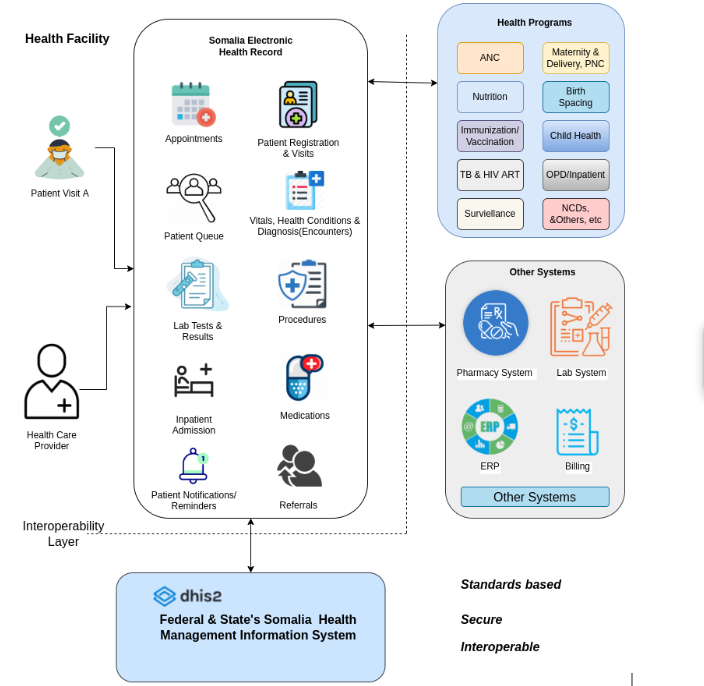
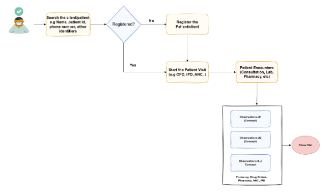

# RAAD EHR ROADMAP

## Introduction

### Purpose of Roadmap
The purpose of the RAAD EHR roadmap is to provide a blueprint on the implementation and roll out of the RAAD EHR in Somalia, timeline, costs and the  anticipated plan of actions by the Federal and States Ministry of Health. The document gives guidance to implementers, users and funders on the work the Ministry of Health is carrying out, and the goals and objectives  intended to be achieved.

The EHR roadmap describes what has been achieved to-date and describes further on how the Federal and State Ministry of Health plans to better coordinate the expansion and integration into the health service delivery at all levels through setting up of ICT infrastructure, and the training of health workers in the use of ICT to improve efficiency of health services delivery.

The RAAD EHR system roadmap is a living document and will continue to receive regular updates on quarterly and annual basis given the dynamic nature of delivering health services, new learning and improvements from the pilot implementation, and the changes in the technology. 

### Background & Current Status
Somalia is emerging from decades of conflict which destroyed government institutions and the
social and economic infrastructure of the country, resulting in the absence of government control, oversight, and funding of the basic social services such as health and education. After years of statelessness, a provisional constitution was adopted in 2011 which paved the way for the establishment of the current Federal Government of Somalia (FGS) and its subsequent formal recognition by the international community in 2012. 

The health sector, like the other social service sectors, is recovering from the disintegration and
dysfunction of state institutions. The Ministry of Health Somalia realizing the importance of reliable data in decision-making, efforts of rebuilding HIS had commenced with the conception of the EPHS in 2009 as the main vehicle of health service delivery. Subsequently, the first Somalia post-civil war Health Sector Strategic Plan (HSSP I) laid the foundation for development of the public health management information system in 2013. The plan provided strategic directions and established a public health sector information management system to capture a core set of health data indicators with health facilities as primary sources of data.
Subsequently, in collaboration with development partners, MoH in 2017 adopted a DHIS2-based M&E system to provide data management functions on collection, analysis and reporting of quality health data for health programs.

Despite the challenges, over the past decade, the implementation of information systems strategic interventions have transformed ways in which health data and information is collected, stored, analyzed and disseminated at state and regional governance levels. Somalia HMIS has been at the forefront of this transformation on the collection, analysis, and use of health information for evidence decision making. 

While the implementation of the Somalia HMIS on the DHIS2 platform has improved the reporting flow from health facilities to district/state/federal levels, a critical challenge persists at the health facility level. Patient data collection and management still rely on cumbersome and error-prone paper-based methods, primarily using registers. This approach has resulted in various data quality issues, including underreporting, incomplete records, and occasional inaccuracies. Furthermore, the paper-based system is time-consuming, difficult to maintain, and susceptible to data entry errors and illegible handwriting, highlighting the need for a more efficient and reliable data management solution.

Through the Health Alliance for Digital Development and Action (HADDA) program support to the Ministry of Health on enhancing Somalia's digital health information system. The primary objective of the program is to strengthen the Ministry of Health in Somalia HIS systems to report accurate and dependable information that can serve as the foundation for decision-making at both the Federal and Member State levels

HADDA's approach is based on the findings and recommendations derived from the baseline Health Information System (HIS) assessment. The program identified specific areas of focus, which include:

* Digitalization of HMIS (Health Management Information System) tools at the health facility: Support digitalizing the tools and systems used in  health facilities. This digitalization aims to streamline patient level data collection, management, and reporting within the healthcare system, making it more efficient and accurate. 

* Strengthening Stewardship and Governance Capacity: Enhance the ability of the Ministries of Health (both at the federal and state levels) to effectively manage the digital health information system. This includes improving their governance capacity, ensuring data security, and enabling efficient data utilization for informed decision-making.

RAAD EHR implementation is introduced as a solution to the digitalization of the HMIS tools to improve the use, reporting, and data quality at healthcare facilities. This will help healthcare providers maintain patient records, streamline clinical processes, and ensure interoperability with the broader Health Management Information System (HMIS).

The RAAD EHR  will support the following areas:

1. Outpatient and Inpatient Services.

2. Program-specific services (TB, HIV/AIDS).

3. Integrated public health and clinical surveillance.

4. Registration and management of patients/clients' information.

5. Clinical management.

6. Pharmacy/medication management.

7. Lab management.

8. Data management, reporting, and data analysis.

9. Clinical decision support.

10. Integration with other software platforms such as DHIS2.

The development of the RAAD EHR will be built on experience and lessons learnt from implementing systems such as the Somalia HMIS, and other digital collection tools(ONA, etc), to come up with an EHR that works within the local health facility environment. This system will need to take into account technical and infrastructural constraints as well as the skills of the intended primary users of the system.

### EHR Objectives

THe overall goal of the RAAD EHR development and deployment is to implement a standards-based, interoperable, patient-centric system that supports end to end patient care and management in the continuum of care to ensure high quality of health service delivery, and ensure timely and quality reporting for evidence based decision making. 
The specific objectives of the RAAD EHR are:

* To improve patient/client care and management through the continuum of care.

* To improve the quality of care in the health delivery system.

* To support patient/client care and management at all levels of the health delivery system.

* To integrate and interoperate with other health systems, and integration with the Somalia HMIS(dhis2) for monthly HMIS reporting. 

* To provide quality and timely information for evidence based decision making at all levels. 

### Short-Term Outputs/Outcomes 

* Digitize all registers into the EHR platform.

* Provide minimum ICT Infrastructure setup for full operationalization of the EHR. 

* Complete installation of the EHR in 70% of the service delivery points.

* Training of the Healthcare workers on use of the EHR and digital equipment for patient/client management.

* Report generation and integration of 90% reports with DHIS2.

### EHR Justification

* There’s an increasing need for evidence based decision making at all levels. 

* There’s a gap of under-reporting of health indicators into the DHIS2.

* There’s a need for accurate and up-to-date health information for planning and management, surveillance and disease control, and program specific  reporting. 

* Currently there’s no patient level systems at the health facilities for patient management, and  the current system is paper based using registers and summaries. 

### EHR Advantages

Electronic Health Records provide the ability to exchange health information digitally, hence, provide higher quality and safer care to the patients/clients. EHRs will help health care providers to improve care of their clients/patients in the following ways: 

* Improve patient care as with immediate access to patient histories, laboratory results, and medication information, healthcare providers can make more informed decisions.

* Provide accurate, up-to-date, and complete information about patients at their point of care. 

* Enables quick access to patient records in coordinated, secure and efficient care. It enhances data management as EHR provides a centralized platform for storing data, making 
it easier to manage, access, and update information.

* Secure sharing of patient/client information among healthcare providers.

* Supports providers to more effectively diagnose patients, reduce medical errors, and provide safer care.

* Improving patient and provider interaction and communication, as well as health care convenience.

* Enabling safer and more reliable prescribing.

* Helping promote legible, complete documentation and accurate streamlined coding. Electronic records reduce errors associated with poor handwriting, lost or damaged paper records, and incomplete patient information.

* Enhances privacy and security of patient/client data and information

* Improving provider efficiency, and reduced duplication of tasks and improved health.

* EHRs enable better tracking and management of diseases. 

* Over time, EHRs are more cost-effective than traditional paper records. They reduce the need for physical storage space and materials, and minimize the duplication of tests and procedures by providing easy access to patient histories.

## EHR GOVERNANCE

The governance of the Somalia EHR will be led and coordinated by the Federal and State Ministry of Health & Human Services - Health Information Management System Section. The Federal & State Ministry of Health & Human Services will provide the guiding principles related to policies, strategies, and functions to achieve EHR objectives. 
Key objectives of the TCC in EHR governance:

* Maintaining the strategic direction of the EHR development and implementation.

* Establishing transparent and effective communication and accountability mechanisms.

* Oversee the implementation mechanisms of the EHR, and ensure all standard operation standards are adhered to, and avoid conflicting strategies. 

## Software Development and Customisation

### Current status

The RAAD EHR system is presently undergoing an iterative and incremental development and testing phase. This dynamic phase involves continuous improvements to the platform, including the addition of new functionalities, features, and the resolution of any identified bugs. These enhancements are guided by the requirements specifications and are responsive to the valuable feedback received from weekly regional focus groups.

This approach ensures that the RAAD EHR system remains adaptable and responsive to evolving needs and challenges, fostering a robust and user-centric solution for the health service delivery. It reflects a commitment to ongoing refinement and optimization, ultimately enhancing the system's effectiveness and user satisfaction.

###  Sofware Development, Configuration and Customisation

The RAAD EHR is built and customized on the Bahmni platform to model and align to the software requirements specifications for the Somalia EHR. The development of the RAAD EHR utilizes an agile and user-centric approach ensuring there is continuous feedback between the end users and the development team. This facilitates the rapid system development, thorough testing and incorporation of new key functionalities and features that make the system user-friendly and meet the functional requirements. 

The development of new features and additional functionalities are planned using the JIRA project management tool with biweekly sprints. The development team has weekly and regular standup meetings to share the development progress and highlight any blockers or request for additional information. In addition, the testing team has weekly meetings with the focus groups to share and walkthrough the new features and functionalities as well as receive feedback.

This first phase the RAAD EHR has implemented the following MOH register and summaries:

1. ANC 

2. Maternity

3. Outpatient Services

4. Birth Spacing

5. Immunization

6. Nutrition

7. Laboratory services

### User Acceptance Testing (UAT)

The UAT process is a critical phase in ensuring that the RAAD EHR system meets user needs and operates effectively in the health facility environment. It will serve as the final validation step before the system is deployed in the health facilities, helping to identify and address any issues that could impact the EHR's functionality and usability.

### Pilot Phase

The RAAD EHR pilot will encompass the following:

1. End User Training: Training sessions will be conducted to equip end-users with the necessary skills and knowledge to effectively use the RAAD EHR system based on the training plan developed.
2. Deployment of ICT Equipment: The essential ICT equipment required for the EHR system, including hardware and network infrastructure, will be deployed and set up in the healthcare facilities.
3. Installation of the RAAD EHR: The EHR software will be installed on the deployed Server at the health facility. This installation process will involve configuring the RAAD EHR to align with the specific needs and requirements of the healthcare facility.
4. Setup of Health Facility Users: User profiles and access permissions will be created and configured within the RAAD EHR system for health facility users.
5. System Go-Live: The RAAD EHR system will be officially launched and put into active use within the pilot healthcare facilities. At this point the healthcare providers will begin using the system to manage patient records and support healthcare delivery.

## Training

### Development of Training Materials and guides
The training modules for the RAAD EHR:
1. RAAD EHR End User Training Module
2. RAAD EHR System Administrators Training Module
3. RAAD EHR Developer Training Module
4. RAAD EHR Frequently Asked Questions (FAQs)

### System Training

The primary objective of the training program is to empower healthcare workers with the knowledge and 
expertise required to effectively comprehend and utilize the RAAD EHR system. This comprehensive training encompasses three main areas:

* Technical know-how: Health workers will gain foundational understanding of the technical components and intricacies of the RAAD EHR system. This includes familiarity with the system's architecture and underlying technologies.

* Functional Competence: The training will cover the system's functionality, ensuring that healthcare staff can proficiently navigate and utilize its features. This encompasses tasks such as registration, clinical management, data entry, lab management and HMIS reporting.

* Operational Competence: Health workers will be equipped with the skills needed to operate the EHR system seamlessly in their daily tasks. This includes processes related to patient data collection and the utilization of ICT devices as integral tools in their routine work.

In addition, the training sessions(virtual and physical) will be meticulously planned and scheduled at the healthcare facilities to minimize any disruption to patient services. Efforts will be made to ensure that patient care continues smoothly during training sessions. The approach aims to strike a balance between enhancing the capabilities of healthcare workers and maintaining the uninterrupted delivery of healthcare services.

### EHR Support

To ensure the successful and effective implementation of the RAAD EHR system, a tiered support plan will be designed. This support plan will encompass various levels, ensuring that support is readily available at all stages of the implementation process. The tiered support plan will be organized as follows:

* Level One Support (Health Facility): At the primary level, each health facility will have a dedicated EHR system champion. This champion will serve as the first point of contact for assistance and issue resolution within the facility. Their role is to provide immediate support and guidance to the facility's staff.
* Level Two Support (District): Beyond the health facility level, there will be district-level EHR champions who will oversee and coordinate support efforts within their respective districts. They will collaborate with facility champions to address more complex issues and ensure a seamless flow of information.
* Level Three Support (Region): At the regional level, experienced champions will be in place to manage support operations across multiple districts within a region. They will serve as a resource for district champions and work to resolve challenges that may require a broader perspective.
* Level Four Support (State and National):The highest level of support will involve state and national champions. These experts will handle escalated issues that cannot be resolved at lower tiers. They will also play a pivotal role in advocating for necessary changes or improvements at a broader scale.

This tiered support structure ensures that there is a clear pathway for escalating and resolving issues as they arise during the EHR implementation. It also promotes effective communication and collaboration between different levels of the healthcare system, ultimately contributing to the system's success and sustainability. By having dedicated champions at each level, the support plan maximizes the chances of addressing challenges promptly and comprehensively.

### Pilot System Assesment Evaluation

After conducting a pilot of the RAAD EHR system in six health facilities, a comprehensive system performance and impact assessment will be carried out. This assessment and validation process will involve representatives from both the Federal and state level. The primary objective of this assessment is to gather insights into the EHR system's performance(functional and non-functional), its effects on healthcare delivery, and its overall impact on the healthcare infrastructure.

The findings and recommendations resulting from this assessment will play a crucial role in shaping the further customization of the EHR system to align with the specific requirements of the broader health system. This ensures that the EHR system evolves to better meet the needs and expectations of healthcare providers and patients.

Furthermore, the RAAD EHR scale-up plan will be heavily influenced by the lessons learned during the pilot evaluation of the EHR system in the initial six facilities. These lessons will provide valuable insights into what worked well, what could be improved, and what adjustments are necessary to implement the system on a larger scale.

## Scale up Plan

### EHR Assessment and Validation Results

Following the implementation and pilot phase of the RAAD EHR in six health facilities, a detailed system performance and impact assessment will be conducted. This process will involve a broad range of key stakeholders, including healthcare providers, software development specialists, RAAD implementing partners, and Federal and State ministry officials. The aim is to evaluate the system's functionality, user experience, and overall impact on healthcare delivery in the pilot period. 

The assessment will encompass various metrics such as system reliability, user satisfaction, efficiency improvements, and any impact on patient care. Additionally, the assessment will seek to identify any challenges or limitations faced during the implementation phase.

From the results and findings, a validation process will be carried out. This will involve analyzing the data to determine how well the system meets its intended goals and identifying areas for improvement. The gathered insights and feedback will inform the next steps of the scale up implementation of the RAAD EHR.

The recommendations derived from this assessment will be integral for further customization of the RAAD EHR system. This will ensure that the system is not only tailored to the specific needs of each health facility but also aligned with the broader objectives of the healthcare system as the RAAD EHR ultimate goal is to create a user-friendly, efficient, and effective EHR platform that enhances healthcare delivery and outcomes.

### Coordination of Rollout to Other Regions

### Integration With Current Systems

The RAAD EHR system is integrated with the Somalia HMIS to facilitate monthly health summaries reporting. This integration is enabled by a middleware reporting application, which supports the generation of aggregated monthly reports as recorded in the RAAD EHR. These reports are reviewed and then submitted to the national HMIS platform on a monthly basis. To report to the HMIS platform from the middleware reporting application, users are required to have authorized access credentials.

### Continous Enhancement of the EHR

The development and maintenance of the RAAD EHR is a long-term effort, necessitating continuous development and enhancement. This ongoing process supports the introduction of new modules and strengthens existing ones as more health programs are onboarded.

The initial development phase of the RAAD EHR focuses on the MOHs immediate goals, detailed in previously mentioned short-term outcomes. Post-validation, the Federal and State MoH will engage with health facility users and stakeholders to refine system functionalities and guidelines. This collaborative effort will inform a revised roadmap, directing long-term development while balancing user needs and resource availability. The EHR's scope will also extend to health centers and hospitals.

### Equipment Inventory and Quantification of Gaps for Scale up

### Development and Deployment Schedule

The RAAD Rollout plan involves several phases, each with specific tasks, responsible parties, and timelines. Please find the detailed plans on the annex.

| Step                             | Task                                                     | Responsible                            |
|----------------------------------|----------------------------------------------------------|----------------------------------------|
| **1. RAAD Roll out Plan**        |                                                          |                                        |
| **1**                          | Engage the Ministry of Health (MoH) and Health Facility Leadership                                      | MoH & NomadiLab                        |
| **1.1**                        | Stakeholder engagement - Sign off on deliverables as part of the RAAD HADDA project rollout               | MoH & NomadiLab                        |
| **1.2**                        | Sign off on Rollout plan and timelines                                                                  | MoH                                    |
| **1.3**                        | Establish clear lines of communication for ongoing consultation and feedback throughout the deployment | MoH & NomadiLab                        |
| **2. Infrastructure Configuration**|                                                          |                                        |
| **2.1**                          | Facility Network setup and implementation                                                               | MoH ICT, NomadiLab & Network Firm      |
| **2.1.1**                        | Design a secure and efficient network topology based on the procured equipment                          | MoH ICT, NomadiLab & Network Firm      |
| **2.1.2**                        | Procure additional networking resources (cables, socket, power cables, and ISP Internet router)           | MoH ICT, NomadiLab & Network Firm      |
| **2.1.3**                        | Set up secure Wi-Fi access points in strategic locations for mobile access                               | MoH ICT, NomadiLab & Network Firm      |
| **2.1.4**                        | Implementation of the networking trunks, sockets, ethernet cables, network cabinets                        | MoH ICT, NomadiLab & Network Firm      |
| **2.1.5**                        | Configure network, IP address, firewall, and internet access for secure optimal operation                 | MoH ICT, NomadiLab & Network Firm      |
| **2.1.6**                        | Implementation of electrical power cabling to the essential points to ensure power connectivity           | MoH ICT, NomadiLab & Network Firm      |
| **2.2**                          | Setup of the server environment                                                                          | MoH ICT, NomadiLab & Network Firm      |
| **2.2.1**                        | Configure the procured server onsite and the server cabinet - Rack management, redundant power supply, and network connectivity | MoH ICT, NomadiLab & Network Firm      |
| **2.2.2**                        | Install a stable and secure server operating system ubuntu 22.0.4 LTS                                   | MoH ICT, NomadiLab & Network Firm      |
| **2.2.3**                        | Establish a backup system for data protection.                                                            | MoH ICT, NomadiLab & Network Firm      |
| **2.2.4**                        | Configure distributed power backup for the essential networking equipment                                | MoH ICT, NomadiLab & Network Firm      |
| **2.2.5**                        | Setup remote access tool for the RAAD EHR server (Anydesk - unattended)                                  | MoH ICT, NomadiLab & Network Firm      |
| **2.2.6**                        | Test network and server operations with all equipment                                                    | MoH ICT, NomadiLab & Network Firm      |
| **2.2.7**                        | Test internet connectivity speed, All under the security checklist are completed                            | MoH, NomadiLab & Network Firm      |
| **2.3**                        | Training on the network setup and documentation | MoH, NomadiLab & Network Firm |
| **2.3.1**                      | Train HF staff on the basic operation, troubleshooting, and maintenance of the network and server systems     | MoH, NomadiLab & Network Firm       |
| **2.3.2**                      | Provide detailed documentation on the installed network and server configurations, configurations, and user guidelines | MoH, NomadiLab & Network Firm |
| **3. RAAD Installation & Configuration**   |                                                                                                                                                                              |                                        |
| **3.1**                           | Install RAAD in the server                                                                                                                                                   | MoH & NomadiLab                        |
| **3.2**                           | Configure the RAAD according to each Health Facility services                                                                                                               | MoH & NomadiLab                        |
| **3.3**                           | Set up user accounts and roles for the facility team - both RAAD Clinical, Lab, and Somalia HMIS (Training instance - [HMIS Training](https://hmis-training.moh.gov.so/hmis)) | MoH & NomadiLab                        |
|                                   | Test the software in a controlled environment to preempt any issues                                                                                                        | MoH & NomadiLab                        |
| **4. Training & Capacity Building for RAAD** |                                                                                                                                                                              |                                        |
| **4.1**                           | Organize comprehensive training sessions segmented by staff roles                                                                                                           | MoH & NomadiLab                        |
| **4.2**                           | Appoint RAAD champions among staff members to guide their peers                                                                                                             | MoH & NomadiLab                        |
| **4.3**                           | Schedule recurrent training sessions to address software updates and user queries                                                                                            | MoH & NomadiLab                        |
| **5. RAAD UAT**                   |                                                                                                                                                                              |                                        |
| **5.1**                           | RAAD User acceptance testing completed, and issues prioritized for the pilot software version                                                                               | MoH & NomadiLab                        |
| **5.2**                           | RAAD User acceptance testing report completed                                                                                                                              | MoH & NomadiLab                        |
|
| **6. RAAD Implementation**       |                                                                   |                                        |
| **6.1**                          | Assign the Nomadilab team in Somalia to provide onsite support for the initial week for both Health facilities | MoH & NomadiLab                        |
| **6.2**                          | Roll out RAAD in a specific department or all departments at the same time in the Health Facility | MoH & NomadiLab                        |
| **6.3**                          | Collect user feedback and make necessary adjustments based on the use of the RAAD | MoH & NomadiLab, SIDRA                 |
| **6.4**                          | Address and resolve any technical or user-related issues promptly | MoH & NomadiLab                        |
| **7. Support & Maintenance**          |                                                                                                                    |                                        |
| **7.1**                               | Establish an IT support team within Nomadilab to ensure swift troubleshooting and support for HF during the pilot phase, and set up a communication channel for the health facility to report any issues or concerns | MoH & NomadiLab                        |
| **7.2**                               | Ensure the RAAD software is consistently updated to maintain security and introduce new features                   | MoH & NomadiLab                        |
| **7.3**                               | Facility Network and computing equipment support                                                                   | MoH & NomadiLab                        |
| **8. Feedback & Continuous Improvement** |                                                                                                                   |                                        |
| **8.1**                               | Organize routine feedback sessions with healthcare staff                                                           | MoH & NomadiLab, SIDRA                 |
| **8.2**                               | Regularly assess system performance and user satisfaction, making adjustments as required                          | MoH & NomadiLab, SIDRA                 |
| **9. RAAD Evaluation Phase**          |                                                                                                                    |                                        |
| **9.1**                               | Nomadilab, MoH, SPIDER & SIDRA to decide the length of the pilot evaluation phase                                   | MoH & NomadiLab, SIDRA                 |
| **10. RAAD Support and Troubleshooting Process Handover to MoH IT team** |                                             |                                        |
| **10.1**                              | Commencement of the handover preparation process for RAAD support and troubleshooting to MoH/HF IT team          | MoH & Nomadilab, HF Team               |
| **10.1.1**                           | Deployment and installation Training and Support                                                                  | MoH & Nomadilab                        |
| **10.1.2**                           | Transfer of the source code into MoH GitHub repository/RAAD org.                                                   | MoH & Nomadilab                        |

### Deployment Team

The deployment of the EHR involves two specialized teams: network engineers and EHR implementation experts. The network team is responsible for establishing the health facility's network infrastructure to support the EHR system. Meanwhile, the EHR implementation team focuses on installing the EHR on the local server and providing on-site training and support.

Following the launch of the RAAD EHR at the health facility, a minimum of two experienced support personnel(EHR and network specialist) will be assigned to oversee the system's implementation during the initial 2 to 3 weeks post-deployment. This support and mentorship team will gradually decrease their onsite presence as health workers become more confident in using the system. Additionally, the team will provide remote support and address any issues or challenges that the health facilities may encounter

### Cost Estimate of Implementation

Estimated cost of implementation of the RAAD EHR in a primary health facility.

| Area                                  | Estimated Cost (In dollars) |
|---------------------------------------|-----------------------------|
| **ICT Equipment**                     |                             |
| ICT Equipment Installation and Networking setup | 3,000                   |
| **EHR Installation**                  |                             |
| **On-site Technical training, support and mentorship** |                 |
| **Internet**                          |                             |
| **Total Cost**                        |                             |

### Quality Management Plan

In the system development phase, well-tested methodologies and techniques are employed to guarantee the creation of a high-quality product. Following each development sprint or iteration, new functionalities are initially tested by testing engineers. Subsequently, these features are presented to users for acceptance testing. This process ensures that every new feature aligns with user requirements and delivers the intended outcomes.

Training sessions employ an interactive and blended learning approach, combining on-site training, recorded demonstration videos/walkthroughs, and an EHR end-user manual. This comprehensive method ensures that the team gains an in-depth understanding of the system for effective use. In addition, feedback from the training sessions on the system improvement or bugs is incorporated into the system’s future releases. 

Supportive and mentoring visits are regularly conducted to ensure that the system is being used properly and to mentor any trainee/users in areas where they lack confidence. A WhatsApp platform has also been set up for EHR users to share knowledge among themselves and other support personnel.

### Risk Management Plan

### Data Security Plan

The EHR system will be developed with a comprehensive focus on data security, emphasizing the protection of sensitive patient information. 
This involves several key measures:

* Access control - Establishing strict access controls to restrict data access to only authorized personnel for the EHR platform, the servers and the computing equipment used. This includes role-based access to ensure that individuals can only view or modify data relevant to their level of access.
* Audit Trails - Maintaining detailed audit trails to monitor and record all system access and data modifications. This helps in detecting any unauthorized or suspicious activities.
* Regular Security updates and patches - Implementing a routine schedule for updating and patching the system to protect against known vulnerabilities.
* Data Backup and Recovery plans - Establishing robust data backup and recovery procedures to prevent data loss in case of system failures or cyber-attacks. 
* User training and awareness - Conducting regular training sessions for all users of the EHR system to educate them on best practices in data security and privacy.
* Network security - Ensuring the security of the network infrastructure that supports the EHR, including the use of firewalls, intrusion detection systems, and regular network security assessments.
* Physical security measures -  Implementing physical security measures for servers and computing devices where EHR data is stored, to prevent unauthorized physical access.

## RAAD EHR FUNCTIONALITY OVERVIEW

### EHR TECHNOLOGY

RAAD EHR is customized and built on the Bahmni platform, which is a comprehensive EHR system built on a technology stack that includes AngularJS/React, Java, OpenMRS, Odoo, OpenELIS, PostgreSQL, and other components. It offers essential features for patient management, medical records, decision support, stock management, lab management and billing. 

#### Frontend
- **AngularJS:** For building the user interface.
- **React:** Used in newer versions for a more modern frontend experience.

#### Backend
- **OpenMRS:** An open-source medical record system serving as the core EHR platform.
- **Odoo:** For managing hospital operations, including billing and inventory.
- **OpenELIS:** Provides the lab management platform integrated with the EHR.
- **DCM4CHEE:** A PACS (Picture Archiving and Communication System) for managing medical images.

#### Database
- **PostgreSQL:** Used for storing patient data and medical records.

#### Middleware
- **Apache Web Server:** To serve web applications.
- **Apache Tomcat:** For hosting OpenMRS and other Java-based components.
- **Node.js:** Used for real-time updates and synchronization.
- **DHIS2 Integration Interface:** provides integration layer between the EHR and the Somalia HMIS platform.

#### Operating System and Containerization:
- **Linux (typically CentOS or Ubuntu):** Provides a stable and secure server environment.
- **Docker:** provides containerization management.

### Key Functionality
The RAAD EHR includes the following key modules:

1. Client & Patient Registration.
2. Consultation & Medication/pharmacy.
3. Program Specific Consultation. 
4. Laboratory workflow  management.
5. Data management Reports Module.
6. Metadata Management Module.
7. User management Module.

The key functionalities of the system are as follows:

* Standardized Data collection tools and appropriate logic to ensure data quality reporting.
* Clinical and medication management. 
* Standard and capability to easily create reports and adhoc reports.
* Integration/interoperability with the DHIS2, and other health systems

The RAAD EHR will facilitate the following functions:

* Registration of patients along with all required/requested demographic information, patient search and unique patient/client identifier generation.
* Support multiple unique patient identifiers during registration.
* Patient/client queue management
* Support appointment management.
* Support patient alerts and notifications via email/sms. 
* Support program Enrollment of patients to specific program related services.
* Provide standardized capturing of patient information and clinical data.
* Data entry for capturing patient care data and making changes.(Clinical, observations )
* Support retrospective data entry and emergency registration.
* Support web-based customization of forms and management of metadata with limited software code level customization. 
* Display confirmation messages and success messages before events such as saving.
* Support laboratory orders and radiology orders.
* Provide a patient dashboard with all the patient information, clinical and medication.
* Support drug orders at the pharmacy. 
* Support tracking of patient visits and patient enrollment, and providing visit history. 
* Support inpatient management with admission, discharge and transfer/referral modules, and with ward management and inpatient dashboard.
* Support lab workflow, capture of samples/accession number generation, capture test results, and the flow to the clinical modules. Additionally, provide lab test reports and workload dashboard views. 
* Provide stock management and billing capabilities. 
* Role based system administration and user management.
* Reporting functionalities, both ad hoc reports and custom reports.
* Support internationalization. 
* Support audit logging and tracking of changes.   
* Provide automatic backing up of patient data.
* Support seamless installation and management of the platform.

### Interoperability

The RAAD EHR is integrated with the Somalia HMIS platform through an integration interface that supports data aggregation from the EHR and supports secure data exchange/reporting to the RAAD EHR. 

### Health Facility Enabling Environment and Hardware Requirements

| No. | Product Description                                                                             | Quantity |
| --- | ---------------------------------------------------------------------------------------------- | -------- |
| 1   | Cisco LAN switch (POE) -24 ports (Cisco Catalyst 1000-24T-4G-L - Switch - Managed - 24 x 10/100/1000 + 4 x Gigabit SFP (uplink) - rack-mountable) | 1 |
| 2   | Cisco Server Router (Cisco Integrated Services Router 1111 - router - WWAN - Wi-Fi 5)           | 1        |
| 3   | Wireless Access Point (with POE) - Wall Mounts (Ubiquiti UniFi UAP-NanoHD - radio access point - Wi-Fi) | 1 |
| 4   | Server Cabinet Data Network Enclosure 22u Network Data CABINET 600mm by 600mm (TOTEN G3 - Rack - black, RAL 9004 - 22U - 19") | 1 |
| 5   | UPS APC UPS 3kVA UPS Battery Backup and Surge Protector (APC Smart-UPS SMT3000IC - UPS - 2700 Watt - 3000 VA - with APC SmartConnect) | 1 |
| 6   | HP Elitebook Laptop (14” Laptop Intel Core i7/i5 Processor, 16 GB RAM, 512GB SSD Storage, Full HD Monitor, Windows 10 Pro, Compact Design, Long Battery Life) | 2 |
| 7   | Samsung A8 Tablet 10.4 Wi-Fi,Screen Size-10.4 Inches Operating System -Android Q Memory Storage Capacity -32/64 GB - Battery - 7040mAh , (Power banks) | 4 |
| 8   | Printer (HP LaserJet Pro 4002dn - printer - B/W - laser)                                       | 1        |
| 9   | Backup Hard Disk (2 TB) (Transcend)                                                            | 1        |
| 10  | Server System Unit ( i7 series 8-12 Cores, RAM - 32GB, Storage(SSD) - 1TB) Dell OptiPlex Small Form Factor | 1 |
| 11  | HP Monitor (24 Inch )                                                                          | 1        |
| 12  | Wireless USB mouse and keyboard (HP)                                                           | 1        |
| 13  | UPS - 900VA (APC Easy UPS BVX Series BVX900LI-GR - UPS - 480 Watt - 900 VA)                     | 2        |

### Future Developments

## Annex

### 
[RAAD Rollout Plan](https://docs.google.com/spreadsheets/d/1NDreU0WlO1PWyRdZqsSFPXNyv4OoYCb4/edit?usp=sharing&ouid=116691166061786070576&rtpof=true&sd=true)

### List of Abbreviations
* EHR - Electronic Health Record 

* EPHS - Essential Package for Health Services

* FGS - Federal Government of Somalia

* HADDA - Health Alliance for Digital Development and Action

* HSSP - Health Sector Strategic Plan 

* MOH - Ministry of Health

## References

